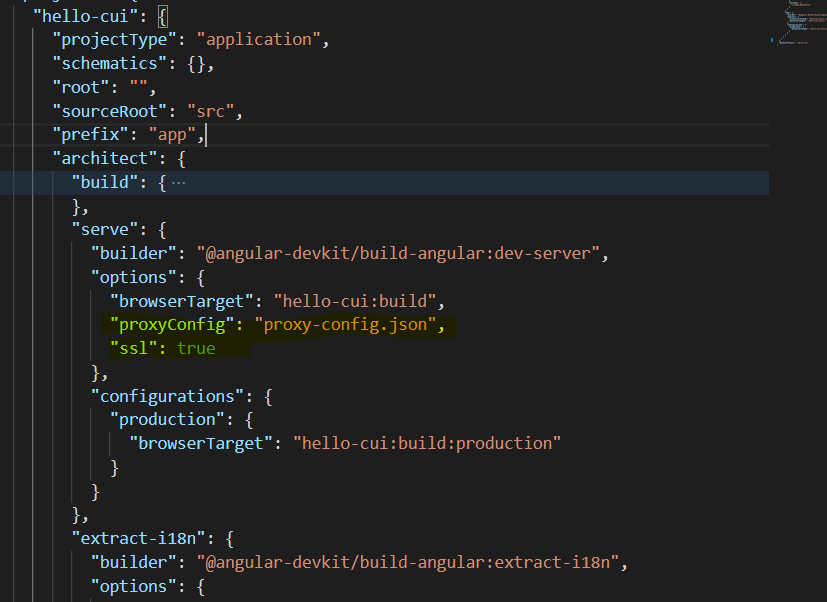

# Creating an angular project for CUI template:
Follow the instructions in [Angular official documentation](https://angular.io/guide/setup-local) to create a new angular application.
> *Note: Following the instructions in the above documentation, you should have the angular CLI and other dependencies installed and configured in your system.*  

## Create angular application:
Run the below Angular CLI command to create "Hello CUI" app.

```nodejs
ng new hello-cui
```
## Configure API proxy in Angular app
During the Angular based CUI template development, it is essential 'ace-lib' components to internally communicate with AgileApps instance (10.13.5+) over APIs. Hence, while development, the angular application needs some proxy configurations.

* Create a JSON file named `proxy-config.json`, put the below content in it and place it in the ROOT directory of 'hello-cui' angular app.
    ```json
    {
        "/networking": {
            "target": "https://agileappshostname",
            "secure": false,
            "changeOrigin": "true"
        },
        "/ace-lib": {
            "target": "https://agileappshostname",
            "secure": false,
            "changeOrigin": "true"
        }
    }
    ```
* Update the `angular.json` to enable proxy and SSL in the development server. Below changes to be made in angular.json.  (Inside, `projects.hello-cui.architect.serve.options`)

    ```json
    {
        "proxyConfig": "proxy-config.json",
        "ssl": true
    }    
    ```
    After the changes the angular.json should look like below:

    

* Next run the angular app by running the below command:
    ```bash
    ng serve
    ```
    Now open the web browser [https://localhost:4200/](https://localhost:4200/).
    > *Note: Give certificate exceptions, when promted.*  
* Next, add the below JS files to the `src/index.html`, just before the `</body>` tag.
    ```html
    <!-- ace-lib includes -->
      <script type="text/javascript" src="/ace-lib/runtime.js"></script>
      <script type="text/javascript" src="/ace-lib/es2015-polyfills.js" nomodule></script>
      <script type="text/javascript" src="/ace-lib/polyfills.js"></script>
      <script type="text/javascript" src="/ace-lib/scripts.js"></script>
      <script type="text/javascript" src="/ace-lib/vendor.js"></script>
      <script type="text/javascript" src="/ace-lib/main.js"></script>
    ```
 * Next, add the below JS files to the `src/index.html`, just before the `</head>` tag.
    ```html
    <!-- ace-lib includes -->
      <link rel="stylesheet" href="/ace-lib/styles.css" />
    ```   
* Next, update the `<base href="/">` as `<base href="./">` and empty the place holder content from `app.component.html`, ensuring the `<router-outlet></router-outlet>` is retained.
* Next add `CUSTOM_ELEMENTS_SCHEMA` 
* Next, configure the routes to use "#" be modifing the the `src/app/app-routing.module.ts` file as below.
    ```typescript
    @NgModule({
      imports: [RouterModule.forRoot(routes, { useHash: true })],
      exports: [RouterModule]
    })
    export class AppRoutingModule { }
    ```
* Next, add the SASS based css themeing support to the application by installing the `ace-lib-theme` using the below command.

    ```bash
    npm i ace-lib-theme
    ```
* Next, import the default theme css file from `node_modules/ace-lib-theme/dist/css/theme.min.css`. To import, open 'style.css' from `src/style.css` and place the below import css statement into it.
    ```css
    @import "ace-lib-theme/dist/css/theme.min.css";
    ```

Now the 'hello-cui' angular app is  ready for development.

